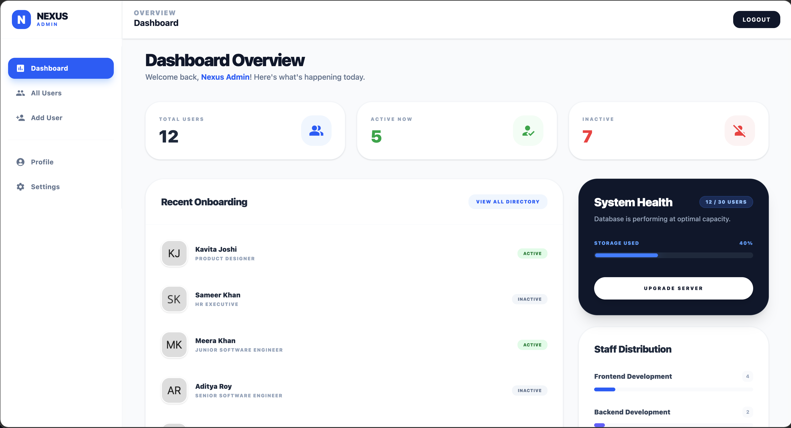

# 🚀 Nexus Admin - User Management Dashboard

Nexus Admin is a professional-grade User Management System built with **React**, **Redux Toolkit**, and **Firebase**. It features a modern, clean UI with full CRUD capabilities, real-time data synchronization, and a sleek analytics overview.

---

## 📸 Preview


---

## ✨ Key Features
* **Full CRUD Operations**: Add, Edit, View, and Delete users with ease.
* **Real-time Database**: Powered by Firebase Firestore for instant data updates.
* **State Management**: Robust and scalable state handling using Redux Toolkit.
* **Modern UI/UX**: Built with Tailwind CSS, focusing on professional spacing, shadows, and typography.
* **Analytics Overview**: Visualized stats for active/inactive users and system health distribution.

## 🛠️ Tech Stack
* **Frontend**: React.js, Tailwind CSS, Lucide React (Icons)
* **State Management**: Redux Toolkit
* **Backend/Database**: Firebase (Firestore & Authentication)
* **Routing**: React Router Dom

## 💡 Key Learnings & Achievements
* **Firebase Integration**: Successfully implemented Firebase Authentication and Firestore, mastering the flow of secure user data management for the first time.
* **Complex UI Implementation**: Developed a high-fidelity dashboard based on modern design principles. This project solidified my confidence in **Design-to-Code conversion**—I can take any complex UI/UX design and build it into a functional React application.
* **Global State Architecture**: Implemented Redux Toolkit to handle data flow across multiple components efficiently.
* **Growth Mindset**: This project represents a significant milestone in my journey as a developer, pushing me to tackle advanced concepts like real-time listeners and dynamic routing.

## 🚀 Getting Started
1. **Clone the repo**:
   ```bash
   git clone [https://github.com/bkumbhare11/nexus-user-management.git]
2. Install dependencies
   npm install

3. Run the project
   npm run dev
